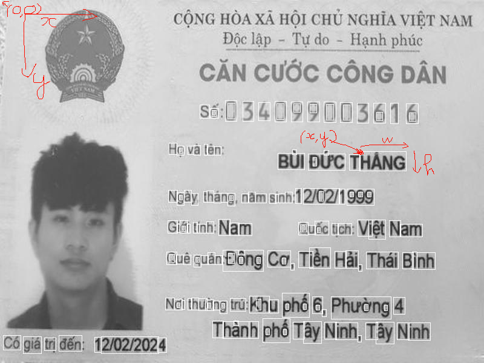

# Báo cáo project: tách thông tin trên thẻ căn cước công dân

Sau khi tìm hiểu,e thấy có thể dùng 2 **bước** chính để làm dự án này: 

+ ### B1: tách vùng thông tin trên thẻ

+ ### B2: nhận dạng kí tự quang học

và 2 **phương pháp** có thể áp dụng:

+ ### PP1: Xử lí ảnh truyền thống (opencv, skimages) 

+ ### PP2: hoặc sử dụng ML/AI 

***

với B1: (tách vùng thông tin trên thẻ)
---

giống như database, tùy vào mục tiêu dự án có thể có 3 cách: riêng lẻ hoặc phối hợp để cho kết quả tốt nhất theo thời gian

> Cách truyền thống

+ lấy ngưỡng và tìm đường viền bao quanh các vùng đó

+ mỗi box có thông tin (x,y, width, height)

+ làm thuật toán ghép các box đó lại với nhau. để lấy được từng dòng

+ tách từng box này ta có thể đưa vào OCR để lấy ngay thông tin

> ML/AI

+ gán nhãn cho bộ dữ liệu và áp dụng object detection để tách các box (có thể tạo 1 model bằng Nanonets và post ảnh đến api để nhận toạ độ box) - tuy nhiên cách này cần một lượng lớn dữ liệu được gắn nhãn tốt để có thể cho kết quả tốt

+ ví dụ model cho trường ID:

> Hybrid

+ sử dụng cách truyền thống cho đến khi có đủ dữ liệu và chuyển dần sang ML/AI (nếu có khả năng tiếp nhận được lượng lớn dữ liệu khi bắt đầu vận hành)

với B2: (nhận dạng kí tự)
---

> cài cục bộ tesseract và sử dụng model của vietocr hoặc github teseract (độ chính xác chưa tốt))

> hoặc sử dụng google drive : đặt mimetype của ảnh tải lên là 'application/vnd.google-apps.document' và tải xuống lại file đó. 

+ lưu ý nếu dùng cách này thì thay vì tải lên từng ảnh, có thể gộp lại thành 1 để tránh limit - nhưng bước này làm cho độ chính xác giảm xuống.

Kết quả:
---

